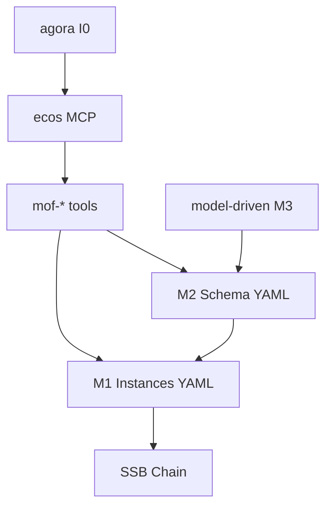

# ecos — Architecture

> **Layer**: L0 协议层  
> **Role**: 协议底座 — SSB 签名链 / MOF 元模型 / 涌现计算 / L0 治理原语  
> **Stack**: Python 3.13+, uv, fastmcp, pyyaml  
> **Health**: See local CI and model/runtime validation
> **SSOT**: 运行时健康、测试通过率、工具链规模以本项目 CI、模型校验和 workspace governance SSOT 为准
>
> 系统全景参见：[`../../docs/PANORAMA.md`](../../docs/PANORAMA.md)

---

## 1. 内部架构



## 2. 入口

| Type | Entry | Port / Notes |
|:--|:--|:--|
| CLI | `ecos-ssb, ecos-dashboard, ecos-scheduler` |  |
| MCP stdio | `src/ecos/mcp_server.py` | MOF + L0 tools |
| HTTP | `ecos-dashboard` | 已收敛至 cockpit :8090 (`/api/ecos/status`) |
| Tools | `mof-validate, mof-derive, mof-bridge-sync, ...` |  |

## 3. 核心模块

| Module | Responsibility |
|:--|:--|
| `src/ecos/l0/ssb/` | SSB signature chain (auth, client, dump, init, integrity, schema_migrate, seq_migrate) |
| `src/ecos/l0/ssot/` | SSOT engine + MOF meta-model + extractor + evolution + monitoring + patterns + performance + recovery |
| `src/ecos/ssot/tools/` | MOF toolchain (34 tool files: mof-*.py, l0_mcp_tools.py, mof_contract_lint.py 等) |
| `src/ecos/l0/governance/` | 15 L0 governance primitives (distributed, role, swarm, personal, task_scheduler, failover, load_balancer, agent_registry, alert_engine, checkers, event_bus, history_store, optimization, primitives, registry) |
| `src/ecos/l0/emergence/` | Emergence calculation (calc, auto, watch, snapshot) |
| `src/ecos/l0/symphony/` | State machine orchestration (matcher, models, state_machine, triggers) |
| `src/ecos/l0/bus/` | Bus protocol |
| `src/ecos/l0/concurrency/` | Lock facade + sqlite lock |
| `src/ecos/l0/triggers/` | Trigger registry + yaml loader |
| `src/ecos/protocol/` | Protocol layer (ssb/ + emergence/, 与 l0/ 同构的兼容映射) |
| `src/ecos/workflow/` | Workflow engine (13 模块: loader, validator, executor, cache, circuit_breaker, backends/, event_listener 等) |
| `src/ecos/services/` | Service layer (governance, integration, monitoring, core, constitution_watcher) |
| `src/ecos/common/` | Common libs (logger, exceptions, config, security, cache, persistence, metrics, governed_fs) |
| `src/ecos/mcp_server.py` | L0 MCP entry |
| `src/ecos/cli/` | CLI (dashboard, scheduler, watchdog, workflow, workflow_runs) |

## 4. 测试

```bash
cd projects/ecos && uv run pytest tests/ -q
```

## 架构概览

参见工作区架构概览图：[`../../docs/ARCHITECTURE-DIAGRAM.md`](../../docs/ARCHITECTURE-DIAGRAM.md)
