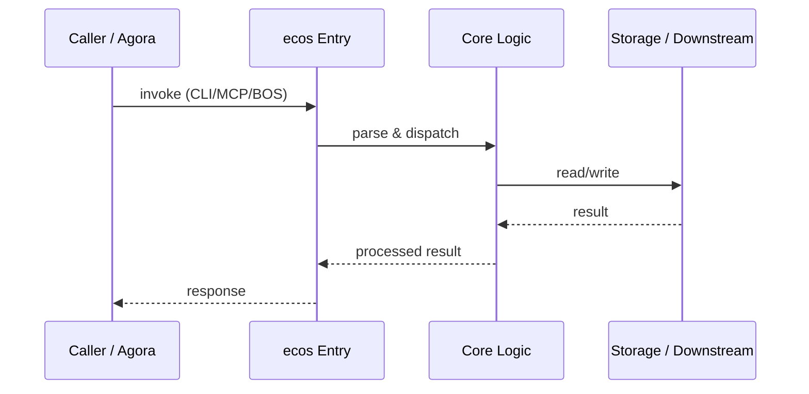

# ecos — Call Chain

> 本文档描述 ecos 内部最核心的一条调用链 / 数据流。
>
> 通用跨层调用链参见：[`../../docs/I0-AGORA-CALLCHAIN.md`](../../docs/I0-AGORA-CALLCHAIN.md)

---

## 关键路径

1. 1. Caller invokes `mof-derive` or BOS URI via agora
2. 2. `ecos` MCP server loads M1 YAML nodes and M2 schemas
3. 3. `mof-schema-validate` checks type/stateMachine/validationRules
4. 4. `mof-derive` reasons across M3/M2/M1 layers
5. 5. `mof-bridge-sync` syncs model-driven ↔ M1 lifecycle
6. 6. Audit output written to L0 SSOT; results returned to caller

## Sequence Diagram

